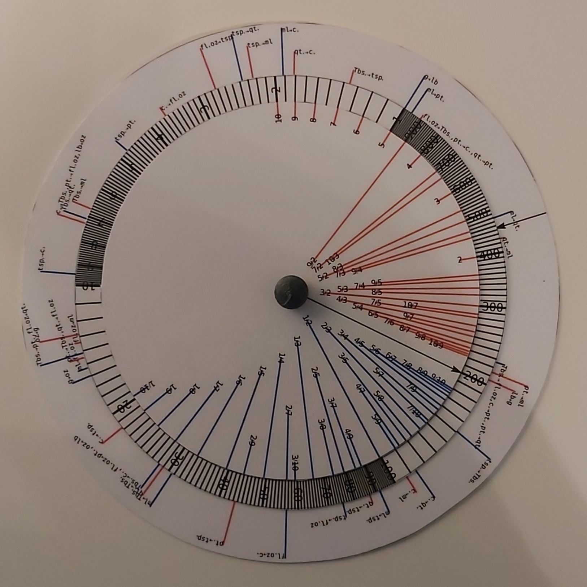
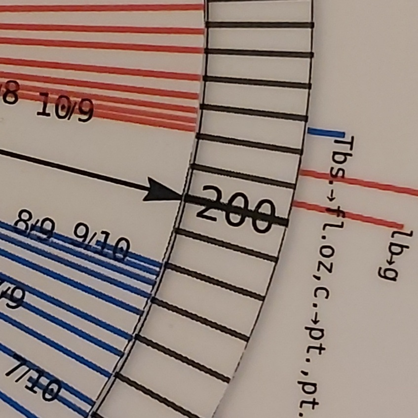
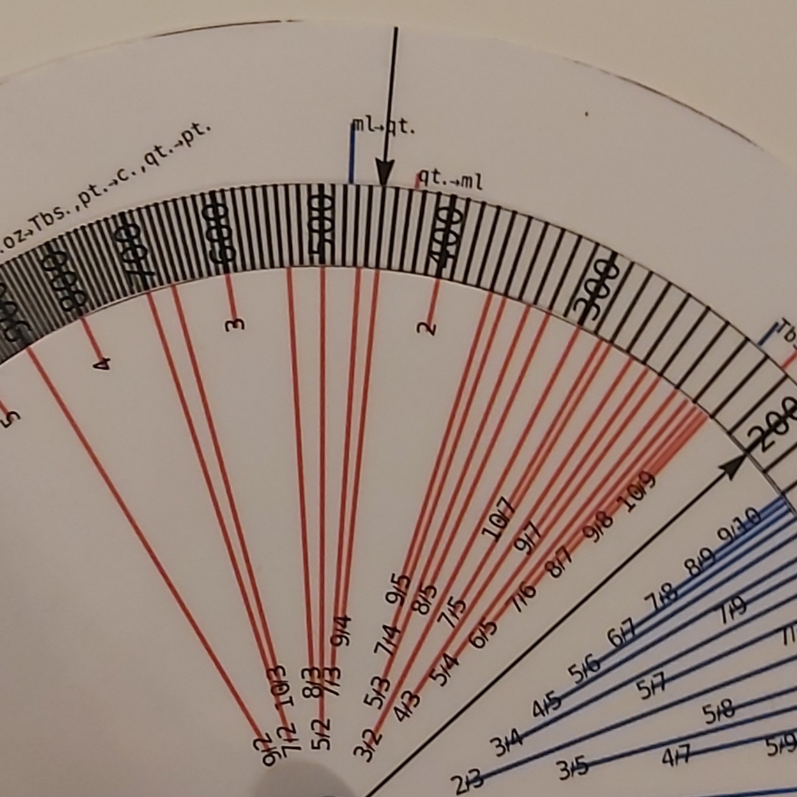
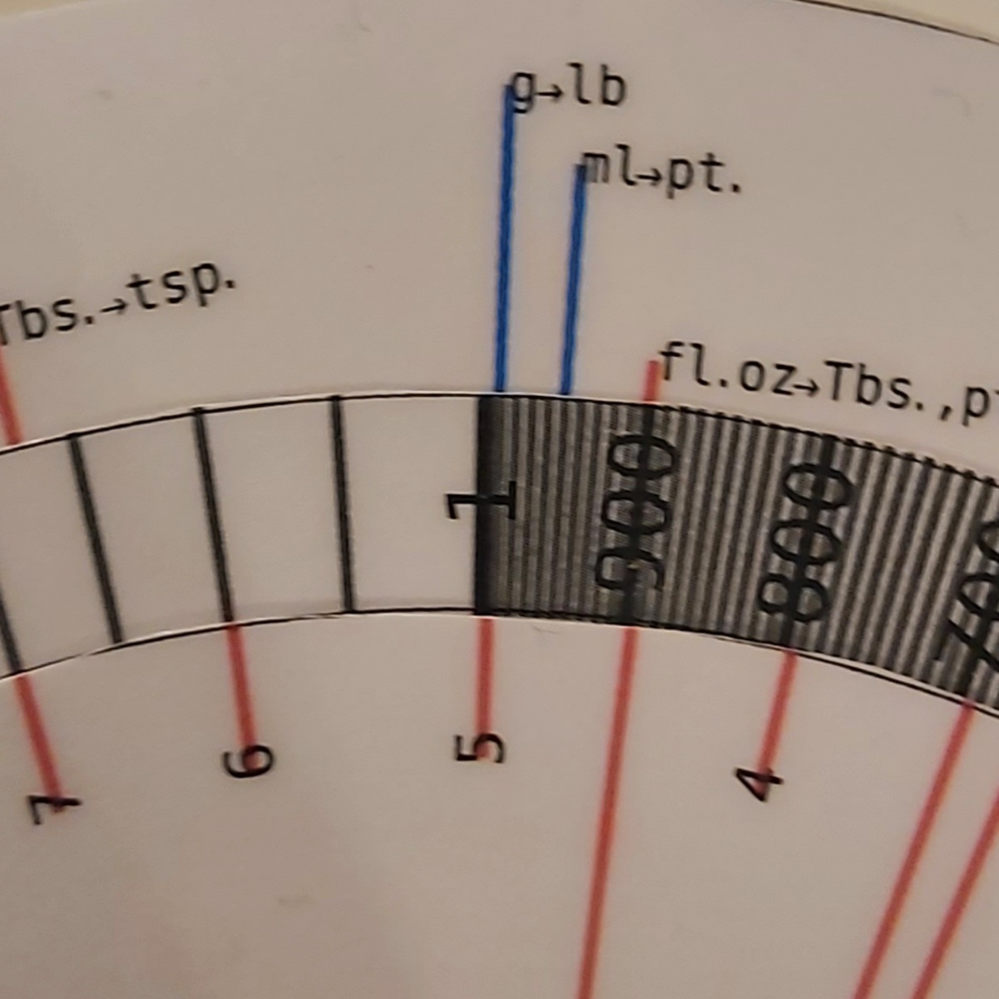

# Instructions

DISCLAIMER: do this at your own risk.

- Careful, the pdf files are designed to have the 
  aspect ratio of A4 paper but the scale might have
  to be adjusted.
- The scale does not have to match A4 exactly but 
  needs to be the same for all PDFs.
- Print the scales "newBasicScale.pdf", "newFractionScale.pdf", "newUnitScale.pdf" -
  preferably on thick paper / cardboad, consider laminating.
- Cut along the most exterior circle in each PDF.
- Join the three scales at the centers, make a rotating joint. 
  The assembled slide rule should resemble the "newScales.pdf". 

# Usage

DISCLAIMER: this is the beta version of the slide rule, there may be bugs.

Let's say your recipe calls for 200g of butter. This will result in 4 servings.
The problem is that you have 9 guests. 

1) Find 200 on the main scale. Point the inner arrow at this tick:

2) Look up 9/4 on the interior scale. The red line points to 450 on the main scale.
   You can mark this with the arrow on the exterior scale.

3) Extra step. Say, you can only measure the butter weight in pounds. 
   Point the arrow on the exterior scale towards 450, if you did not do this
   in the previous step. Now - look up "g. -> lb." on the exterior scale. 
   450 grams is almost exactly 1 pound - the blue line seems to be pointing at
   the correct value on the main scale.

# Red lines blue lines, going over scale

Red lines indicate that we are adding logarithms and going counter - clockwise.
Blue lines indicates that we are subtracting logarithms, going clockwise. 
Going over the scale (over the 1 on the main scale) means that we have to 
multiply by 1000 or divide by 1000. Can you guess which? Hint: this depends
on the color of the line.
